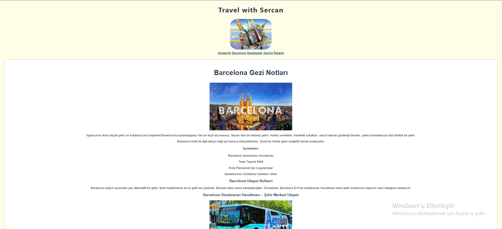

# 🌍 Kişisel Blog Sayfası - Travel with Sercan

Bu proje, HTML5 kullanılarak oluşturulmuş bir **kişisel seyahat blog sayfasıdır**. Sayfada Barcelona, Budapeşte ve Samos şehirlerine ait detaylı gezi notları, ulaşım rehberleri, önerilen mekanlar ve görseller bulunmaktadır.

## 🎯 Proje Amacı

Bu proje, HTML elementleri ile temel bir web sayfası oluşturarak aşağıdaki yetkinliklerin geliştirilmesini hedefler:

- HTML5 yapısı ve temel etiketlerin kullanımı
- Görsellerin ve bağlantıların entegre edilmesi
- Başlık, paragraf, liste ve form elementlerinin uygulanması
- Harici bağlantılar ve gömülü harita kullanımı

## 🧩 İçerik Özeti

### 🔸 Sayfa Yapısı
- `<head>` etiketi içerisinde sayfa başlığı ve karakter seti tanımlandı.
- `<body>` kısmında tüm içerik yapılandırıldı.

### 🔸 Blog Yazıları
- **Barcelona**, **Budapeşte** ve **Samos** şehirleri için ayrı ayrı `<fieldset>` alanlarında:
  - `<h2>` başlıklar
  - `
` paragraflar
  - `<ul>` ve `<ol>` listeler
  - `` görseller (alt metinleriyle)
  - `<a>` bağlantılar
  - `<iframe>` haritalar
  - `<form>` iletişim bölümü

### 🖼️ Kullanılan Özellikler
- 📌 **3 şehir için ayrı blog yazısı**
- 📷 Her blog yazısında en az bir görsel
- 🔗 Diğer sayfalara bağlantı (örneğin: Wikipedia, resmi siteler)
- 📋 İletişim formu: E-posta, telefon, adres alanları
- 🗺️ Google Haritalar iframe kullanımı
- 🎨 Özgün stil ayarları (yazı tipi, renk, kenar boşluğu)

## 🧪 Kullanılan Teknolojiler
- HTML5
- CSS (inline style)

## 📝 Notlar
Bu proje [Patika.dev](https://www.patika.dev) "HTML Ödev 2: Kişisel Blog Sayfası" kapsamında geliştirilmiştir.

---

**© 2025 Travel with Sercan. Tüm hakları saklıdır.**
